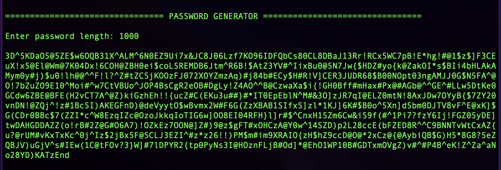

Password Generators 🔒
=======================


<br>


Overview
--------------
Write the same password generator app in different computer languages. <br>
This is an awesome excercise to learn how different languages work. 


<br>


```markdown
# Python (Script + Tkinter GUI)
```
----------
<i>Code output: Python</i>


<br>

```markdown
# Web Stack (Javascript, HTML, CSS)
```
<i>Code output: Javascript</i>


<br>

```markdown
# C 
```
<i>Code output: C lang</i>



<br>